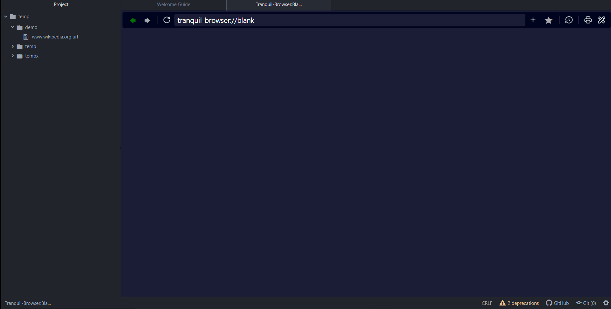

# Tranquil Browser - Browser Package for Pulsar

## Introduction

Welcome to the **Tranquil Browser**, a powerful tool designed to enhance your browsing experience with a variety of features tailored for developers and power users. This package provides a seamless interface for managing and interacting with your web development projects directly within the browser. Below are the key features and usage instructions.

## Features

### 1. **Preview**

- **Description**: Instantly preview your HTML, CSS, and JavaScript changes of your code.
- **Usage**: As you edit your code, you can save the changes and preview it right inside the ide.

### 2. **Context Menu**

- **Description**: Access a full-featured context menu with all the basic browser functions you need, including Cut, Copy, Paste, Select All, and more.
- **Usage**: Right-click on any text or element to bring up the context menu and select the desired action.

### 3. **Zoom**

- **Description**: Easily adjust the zoom level of the current webpage. Whether you need a closer look at the details or a broader view, the zoom feature allows you to scale the content to your preference.
- **Usage**: Use the context menu or keyboard shortcuts (e.g., Ctrl + "+" to zoom in, Ctrl + "-" to zoom out) to adjust the zoom level.

### 4. **Open Link in New Tab/Window/Default Browser**

- **Description**: Choose how you want to open links with options to open in a new tab, a new window, or your default system browser.
- **Usage**: Right-click on a link and select "Open link in new tab," "Open link in new window," or "Open link in default browser" from the context menu.

### 5. **Inspect/Devtools**

- **Description**: Access the powerful Developer tool directly from the context menu. This feature allows you to view and modify the HTML and CSS of the current page in real-time.
- **Usage**: Right-click on any element and select "Inspect" to open the developer tools and inspect the HTML structure and styles.

### 6. **Back/Forward/Refresh Button**

- **Description**: Navigate through your browsing history with ease using the Back and Forward buttons. Quickly revisit previously viewed pages without losing your place and refresh the current page with a single click to ensure your changes are reflected or to reload content.
- **Usage**: Click the Back button to return to the last page you visited or the Forward button to go back to the current page if you’ve navigated backward and Use the Refresh button to reload the current webpage

### 7. **History**

- **Description**: Keep track of your browsing history with a detailed list of pages you’ve visited. Easily jump back to any previously viewed page.
- **Usage**: Access the History tab to view a list of all the pages you’ve visited during your current session. Click on any entry to revisit that page.

### 8. **Print**

- **Description**: Print the current webpage directly from the browser. This feature provides an easy way to generate hard copies or PDFs of your web content.
- **Usage**: Right-click on the page and select "Print" from the context menu, or use the keyboard shortcut (e.g., Ctrl + P) to open the print dialog.

### 9. **Save link to Treeview**

- **Description**: Organize your projects by adding URLs directly to the Treeview. This allows for easy access to frequently visited sites and resources within your project structure.
- **Usage**: Right-click on a URL and select "Add to Treeview" to save it in your project’s directory for quick access later.

### 10. **Open .url Files from Treeview Directly in the Browser**

- **Description**: Open .url files directly from the Treeview within the browser. No need to copy and paste URLs—just click and go!
- **Usage**: Navigate to a .url file in the Treeview and click it to open the linked webpage directly in your browser window.
